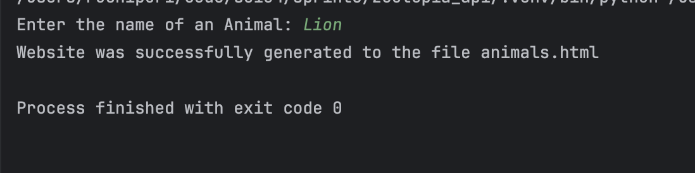
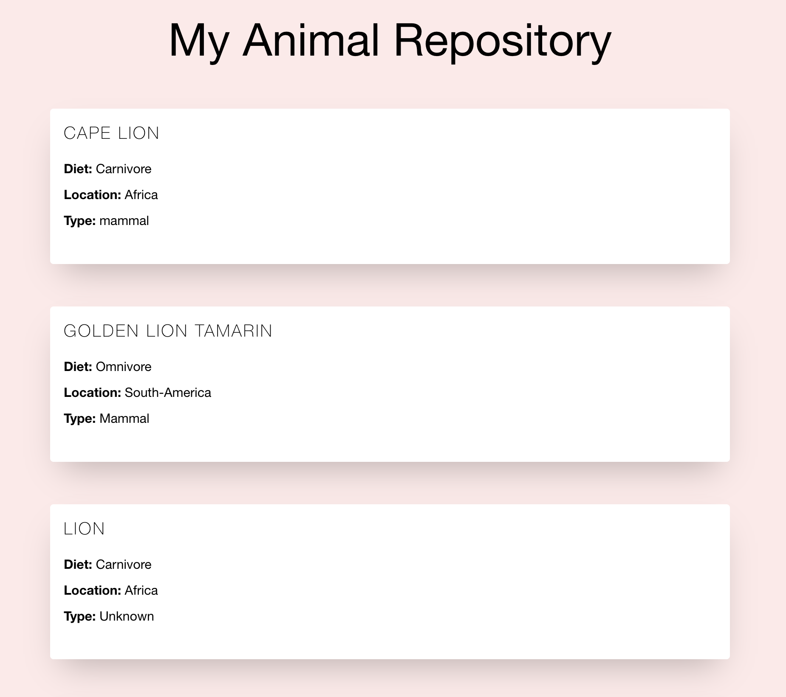

# My Zootopia Project

Search an animal name or a part of animal name to get a list of animals and more information like Diet, Location and Type of that animal.

## Installation

To install this project, simply clone the repository and install the dependencies in requirements.txt using `pip`

## Usage

To use this project, run **animals_web_generator.py**

Please note an API key is needed.

:)

example screenshots: 

